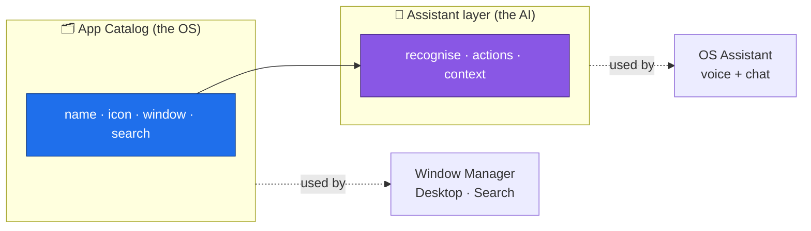
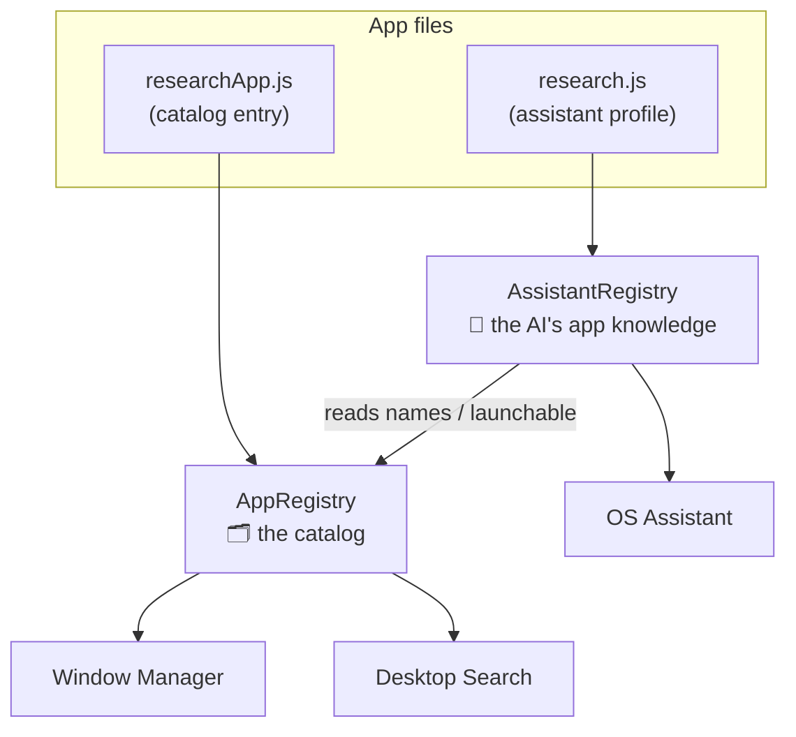
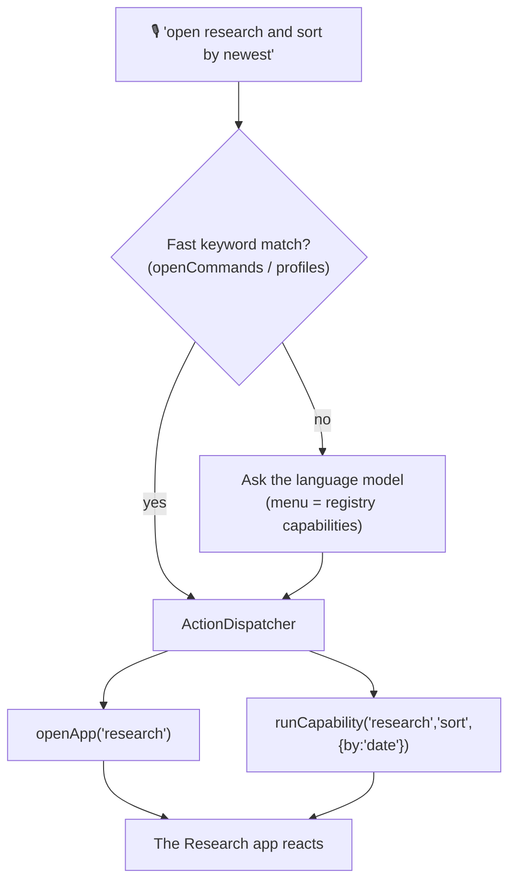

# How Apps Work & How the AI Knows About Them

> This describes how AndreOS apps are defined and how the OS Assistant (the AI)
> discovers what apps exist, what they can do, and how to act in them — and why
> the design scales to many more apps.

---

## 1. The big idea: two layers

Every app is described in **two separate layers**:

1. **App Catalog** — what an app *is* to the OS: its name, icon, window size,
   and whether it shows up in search. This layer knows **nothing** about the AI.
2. **Assistant layer** — what the AI *knows* about the app: how to recognise it
   in speech/text, what actions it can perform, and what it can read on screen.

The Assistant layer builds on top of the Catalog. The Catalog never depends on
the Assistant.



Why two layers? Because an app can exist **without** being AI-aware. It just
skips the Assistant layer. And the AI never needs to care about pixels or window
sizes — it only reads the Assistant layer.

---

## 2. What an app looks like

Each app is written in **two small files**.

**① The catalog entry** — how the OS shows and opens it:

```js
// apps/catalog/researchApp.js
export const researchApp = {
  id:    'research',
  name:  'Research',
  title: 'Research',
  icon:  '🔬',
  kind:  'research',
  window: { width: 1040, height: 660, render: getResearchContent },
  searchable: false,
};
```

**② The assistant profile** — how the AI understands and drives it:

```js
// apps/assistant/profiles/research.js
export const researchProfile = {
  appId: 'research',

  // How the AI recognises this app from what the user says
  match: /research|paper|publication|science|forskning/,
  voiceKeywords: ['research', 'publications', 'papers', 'forskning', ...],

  // What the AI can DO inside this app
  capabilities: [
    { id: 'openPaper', scope: 'when-active',
      description: 'Open the Nth paper in the current list.',
      params: { n: 'integer (1-based index)' },
      invoke: ({ n }) => window.__ResearchApp?.openPaper(n) },

    { id: 'sort', scope: 'when-active',
      description: 'Sort papers by citations, newest, or oldest.',
      params: { by: "'cited' | 'date' | 'asc'" },
      invoke: ({ by }) => window.__ResearchApp?.setSort(by) },
    // …filter, search, categories
  ],
};
```

An app with no profile (like IronFlow) is fully usable by the OS but invisible
to the AI — a clean, deliberate choice.

---

## 3. The two registries

At startup, each app registers itself into the layer it belongs to.



- **`AppRegistry`** answers OS questions: *what window do I open for `research`?*
  *which apps appear in search?* *what's this app's label?*
- **`AssistantRegistry`** answers AI questions: *which app did the user mean?*
  *what can I do in the focused app right now?*

`AssistantRegistry` leans on `AppRegistry` for names and the "can be opened"
flag — the arrow only ever points AI → Catalog.

---

## 4. How the AI gets to know about apps

The Assistant never has app knowledge baked into it. It **asks the registry**
three things:

| The AI asks… | The registry answers with… | Used for |
|---|---|---|
| "Which app is this?" | `resolveId("cv") → resume` | Turning words into an app |
| "How do I open apps?" | `openCommands()` → keyword list | Fast, offline matching |
| "What can I do here?" | `capabilities({ activeAppId })` | Actions for the focused app |

Two nice properties fall out of this:

- **Scoped actions.** A capability marked `when-active` is only offered when its
  app is focused. Ask "sort by newest" with Research open → the AI sees the
  `sort` action. With About open → it sees nothing research-specific. The AI's
  menu stays small and relevant.
- **Auto-generated AI prompt.** The list of apps the language model can open is
  built from the registry, so the model's instructions update themselves when
  you add an app.

---

## 5. What happens when the user says something



- The **fast layer** handles simple, common phrases instantly and works even
  before the AI model has loaded.
- The **model layer** handles anything trickier, using the registry's
  capabilities as its menu of valid actions.
- Both funnel into one place — the **`ActionDispatcher`** — which is the single,
  uniform way any action gets executed. No more scattered per-app globals.

---

## 6. Where everything lives

```text
apps/
├── catalog/                 🗂️  OS layer — what apps exist
│   ├── AppRegistry.js            the catalog registry
│   ├── researchApp.js            one entry per app
│   ├── browserApp.js  …
│   └── index.js                  registers the catalog
│
├── assistant/               🤖  AI layer — how the AI drives apps
│   ├── AssistantRegistry.js      resolve names, list actions
│   ├── ActionDispatcher.js       the one way to run an action
│   ├── profiles/
│   │   ├── research.js           recognise + capabilities
│   │   ├── browser.js  …
│   │   └── contentApps.js
│   └── index.js                  registers the profiles
│
└── index.js                 registers both, exports both registries
```

---

## 7. Adding a new app

| You want… | You write… |
|---|---|
| An app the OS can open | **1 file** — a catalog entry |
| …that the AI can also open by name | **+ a profile** with `match` + `voiceKeywords` |
| …that the AI can *act inside* | **+ `capabilities`** in that profile |
| …that the AI can *answer questions about* | **+ a `context`** provider in that profile |

That's the whole surface area. No touching the assistant code, no prompt edits,
no dispatch switches. Register the entry (and optionally the profile) in the
matching `index.js`, and you're done.

---

## 8. Why it scales

- **The AI menu stays small.** Only global actions plus the focused app's
  actions are ever shown to the model, so a catalogue of 5 apps or 500 apps
  produces the same-sized prompt.
- **Apps are independent.** Each app owns its own description. Nothing else needs
  editing, so apps can be added, removed, or shipped by different people without
  collisions.
- **Actions are uniform.** Every action runs through the `ActionDispatcher`, so
  logging, permissions, or undo can be added in one place later.
- **Ready for apps from elsewhere.** A profile is just data plus functions. A
  remote or sandboxed app can hand over its own profile, and the assistant drives
  it exactly like a built-in one.
- **AI-aware is opt-in.** Apps without a profile stay invisible to the AI — so
  growth on the OS side never bloats the assistant.

---

## In short

Apps describe themselves in two layers: a **catalog entry** (what the OS sees)
and an optional **assistant profile** (what the AI knows). Two registries hold
them; the assistant reads the AI layer to recognise apps, list their actions,
and run them through one dispatcher. Adding an app is one or two small files —
and the assistant scales because it only ever looks at what's relevant right now.
