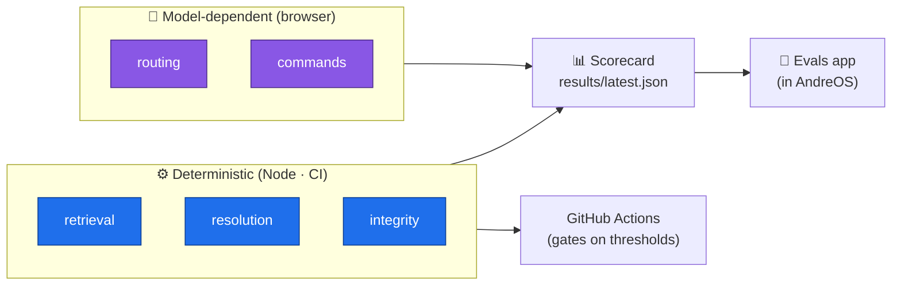
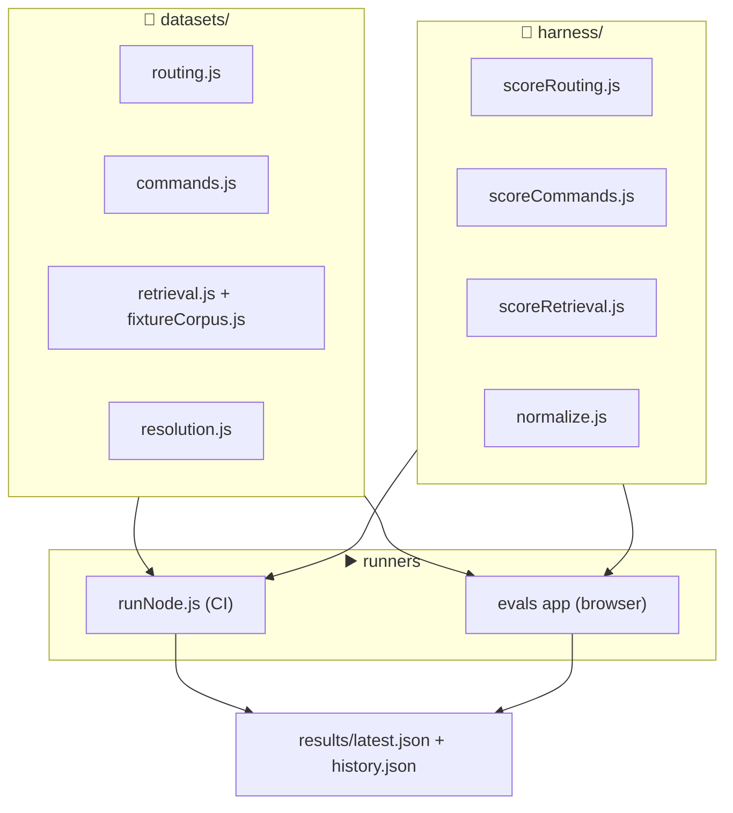
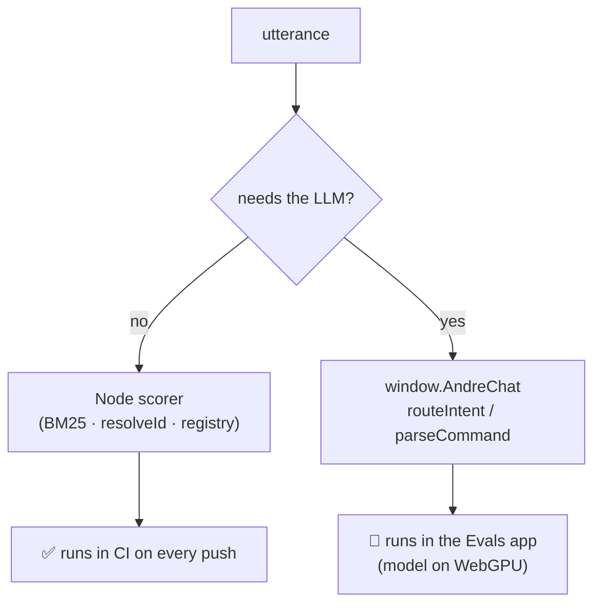
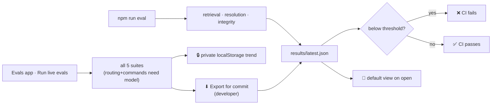

# How the Assistant Is Evaluated (Evals)

> This describes how AndreOS measures the quality of its OS Assistant — what it
> tests, where the metrics live, how the same scorers run in CI and in the
> browser, and why the design scales as the assistant grows.

---

## 1. The big idea: score the decisions, not the vibes

The assistant makes a handful of **distinct decisions** on every utterance. Evals
give each decision its own score, so "is the assistant good?" becomes a set of
concrete, trackable numbers instead of a gut feeling.

Two properties shape the whole design:

- **Some decisions are deterministic** (pure JavaScript: retrieval ranking, app
  name resolution, registry structure). These run **headlessly in Node/CI** —
  fast, reproducible, and a hard gate on every push.
- **Some decisions need the real language model** (routing an *ask* vs a
  *command*, parsing a command into actions). The model runs on **WebGPU in the
  browser**, so those suites run **live inside an Evals app** and their results
  are committed back to the repo.



---

## 2. What gets measured

Each decision point in the assistant maps to one **suite**. A suite is a golden
dataset plus a scorer that emits a single headline metric (and supporting ones).

| Suite | Assistant code | Question it answers | Headline metric |
|---|---|---|---|
| **routing** | `routeIntent()` in `chat.js` | Is this an *ask* or a *command*? | accuracy |
| **commands** | `parseCommand()` in `chat.js` | Did it produce the *right actions*? | exact-match |
| **retrieval** | `RAGEngine` / `BM25` | Did it surface the *right paper*? | hit@3 |
| **resolution** | `AssistantRegistry.resolveId()` | Did a spoken name map to the *right app*? | accuracy |
| **integrity** | the two registries | Are all profiles/capabilities *well-formed*? | pass/fail |

The first two are the "how well does it follow **ask** questions and do the right
thing" suites — the reason evals exist. The last three protect the plumbing those
two rely on.

---

## 3. The three layers

Evals are built from three small, independent layers — mirroring how apps are
built in this codebase.



- **Datasets** are the single source of truth — plain data, tagged so weak
  categories show up in the scorecard. Add a row, and both runners pick it up.
- **Scorers** are pure functions shared by *both* runners, so a number computed
  in CI means exactly the same thing as one computed live in the browser.
- **Runners** feed the same datasets through the same scorers; only the
  *predictor* differs (a pure function in Node, the real engine in the browser).

---

## 4. Why the scorers are shared

The golden trap in eval systems is having two implementations drift apart. Here,
`normalize.js` defines the canonical comparison rules once:

- An action is reduced to a stable key — `open:research`, `open_paper:40`,
  `browse:github.com`.
- Free-text fields a small model can never reproduce verbatim (a `chat` message)
  are matched by **kind, not wording**.

Both `runNode.js` and the Evals app import the *same* `scoreCommands`,
`scoreRouting`, and `scoreRetrieval`. A live browser run and a CI run are
therefore directly comparable — no "it passed locally" ambiguity.

---

## 5. Deterministic vs model-dependent — and why the split



- **Retrieval** is scored against a **committed fixture corpus**
  (`fixtureCorpus.js`), *not* live OpenAlex — so it never touches the network and
  is fully reproducible in CI.
- **Resolution** and **integrity** import the live registries (with a tiny DOM
  shim) and inspect them directly.
- **Routing** and **commands** call the real in-browser engine. They cannot run
  in headless CI without WebGPU, so the Evals app is their home; a developer can
  **export** a run and commit it to publish those numbers.

---

## 6. Where metrics live

Metrics are committed to the repo — no backend required — which gives the Evals
app a free trend history.

```text
tests/evals/
├── datasets/            📁 golden truth (data only)
│   ├── routing.js
│   ├── commands.js
│   ├── retrieval.js
│   ├── fixtureCorpus.js
│   └── resolution.js
├── harness/             🧮 pure scorers (shared Node + browser)
│   ├── normalize.js
│   ├── scoreRouting.js
│   ├── scoreCommands.js
│   └── scoreRetrieval.js
├── runNode.js           ▶️ deterministic runner (writes the scorecard)
└── results/
    ├── latest.json          the current scorecard
    └── history.json         trimmed per-run headline metrics (trend)
```

- `latest.json` — the canonical scorecard the app and CI both read.
- `history.json` — one small entry per run, powering the sparklines.

### Default view & privacy

The Evals app **always opens on the committed `latest.json`** — the published,
canonical results that everyone sees first. When a *visitor* runs the evals in
their browser, that run is shown in-session and its headline metrics are kept
**privately in their own `localStorage`** (feeding only their trend sparklines).
Visitor runs are **never** written back to the repo and never override the
default on open — their actions stay private to their browser.

Publishing new numbers is a deliberate **developer** action: run the evals
locally, click **⬇ Export for commit** to download a `latest.json` (identical in
format to what `runNode.js` writes), drop it into `tests/evals/results/`, and
commit. This is the only way the LLM suites (routing + commands) — which can
only run in a browser — reach the deployed site.

---

## 7. How a run happens

**In CI / locally** (`npm run eval`):

1. Build a BM25 index over the fixture corpus → score retrieval.
2. Import the registries → score resolution + integrity.
3. Write `latest.json` + append to `history.json`.
4. **Exit non-zero** if any suite falls below its threshold in `THRESHOLDS`.

**In the browser** (the 🧪 Evals app → *Run live evals*):

1. Re-run the deterministic suites in-page (instant, for parity).
2. If the Ask André model is loaded, run **routing** and **commands** through
   `window.AndreChat` and score them with the shared scorers.
3. Render the scorecard with pass/below-threshold badges and trend sparklines.
   The run stays private (localStorage); a **developer** can **Export for
   commit** to publish it.



---

## 8. Adding to the evals

| You want… | You do… |
|---|---|
| A new test case | **Add a row** to the relevant `datasets/*.js` file |
| A new fixture paper | Add an entry to `fixtureCorpus.js` (+ reference it in `retrieval.js`) |
| A new metric on a suite | Extend the scorer in `harness/` (both runners get it) |
| A new suite (new decision point) | Add a dataset + a scorer + wire it into `runNode.js` and the app's `SUITE_META` |
| A stricter CI gate | Bump the `min` in `THRESHOLDS` in `runNode.js` |

No assistant code changes to add coverage — datasets and scorers are the whole
surface area.

---

## 9. Why it scales

- **One dataset, two runtimes.** The same golden files drive CI and the browser,
  so coverage never forks.
- **Shared scorers.** A metric is defined once; committed and live numbers are
  always comparable.
- **Registry-driven.** Resolution and integrity read the live registries, so as
  apps are added their names and capabilities are automatically in scope.
- **Committed metrics = free history.** No database or service — the trend lives
  in `history.json`, versioned alongside the code that produced it.
- **Honest about the model.** Model-dependent suites are clearly separated and
  never faked in CI; they run where the model actually lives.

---

## In short

Every assistant decision gets a **suite**: a golden dataset plus a shared scorer.
Deterministic suites (retrieval, resolution, integrity) run in **Node/CI** and
gate every push; model-dependent suites (routing, commands) run live in the
**Evals app** against the real engine. Both write the same `latest.json`, so the
scorecard — and its committed trend history — tells you, in concrete numbers, how
well the assistant follows *ask* questions and whether it does the right thing.
